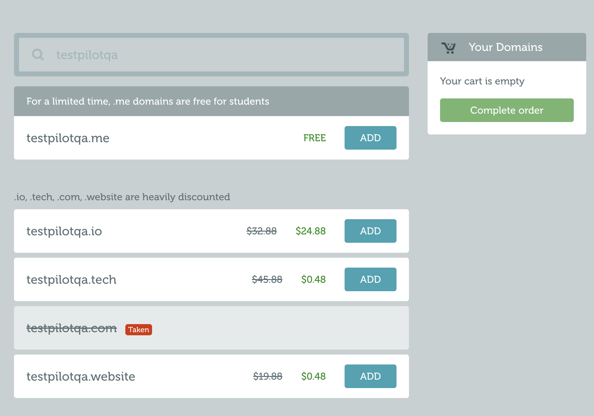
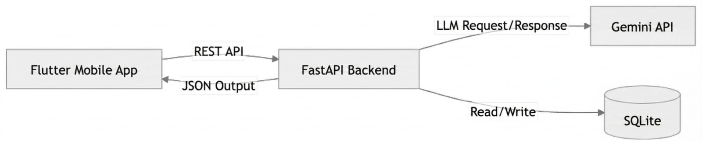

# 📋 ÜRÜN GELİŞTİRME PROJESİ — FİKİR ONAY DOKÜMANI

> **Öğrenci Adı Soyadı:** `Emir Buğra Irmak`
> **Öğrenci Numarası:** `21253061`
> **Tarih:** `06/03/2026`

---

## 1. 🏷️ Ürün İsmi

| Alan | Açıklama |
|------|----------|
| **Ürün İsmi** | `TestPilot – AI QA Assistant` |
| **İsmin Anlamı / Hikayesi** | `Pilot” kelimesi, uçuştan önce yapılan kontrol ve yönlendirmeyi çağrıştırır. TestPilot da yazılım geliştirme sürecinde canlıya çıkmadan önce gereksinimleri analiz edip test planı ve test senaryolarını çıkararak kaliteyi “pilot” gibi yöneten bir asistan fikrini temsil eder.` |
| **Slogan** | `From idea to test cases, in minutes.` |

---

## 2. 🎨 Ürün Markası

| Alan | Açıklama |
|------|----------|
| **Marka Adı** | `TestPilot` |
| **Marka Kimliği** | `Güvenilirlik, netlik, hız, kalite odaklılık, geliştirici/QA dostu yaklaşım, süreç disiplini (standardize edilmiş çıktı).` |
| **Hedef Kitle Algısı** | `“Kolay kullanılan; QA işini hızlandıran ve standardize eden akıllı bir yardımcı.” Özellikle stajyer/junior QA'ların da rahat kullanabileceği pratik bir araç.` |
| **Marka Renk Paleti** | `Ana renk: Lacivert (güven/kurumsallık). Yardımcı renkler: Açık mavi (teknoloji), turuncu (aksiyon/uyarı–bug vurgusu), gri tonları (sadelik).` |
| **Tipografi** | `Inter (UI için modern ve okunaklı). Alternatif: Roboto.` |

---

## 3. 🌐 Domain (Alan Adı) Kontrolü

| Alan | Açıklama |
|------|----------|
| **Birincil Domain** | `testpilotqa.me` |
| **Domain Müsait mi?** | `Evet — Kontrol tarihi: 03/03/2026` |
| **Kontrol Yapılan Site** | `namecheap.com` |


> 📸 **Ekran Görüntüsü:**
> 

---

## 4. 💰 Paketleme Modeli (Free & Premium)

### 4.1 Free (Ücretsiz) Paket

| Özellik | Açıklama |
|---------|----------|
| **Özellik 1** | `Mod A & Mod B (Temel): Mod A: kullanıcı sadece “feature fikri” girer → User story (veya iş gereksinimi) + AC’yi AI üretir. / Mod B: kullanıcı story/AC’yi hazır girer → AI sadece test plan/test case üretir.` |
| **Özellik 2** | `Çıktı formatı: Markdown + JSON çıktı alma` |
| **Özellik 3** | `Temel şablonlar: Smoke/Regression etiketleme + basic bug report taslağı` |
| **Özellik 4** | `History (kısıtlı): Son 15 çalışma kaydı (run history)` |
| **Kısıtlamalar** | `Ayda 30 üretim (LLM çağrısı) • Tek proje • TestRail CSV export yok • Batch (çoklu story, çoklu işlem) yok • Custom template/prompt yok • “Generated by TestPilot” watermarkı mevcut` |

### 4.2 Premium (Ücretli) Paket

| Özellik | Açıklama |
|---------|----------|
| **Aylık Fiyat** | `$4.99 / ay` |
| **Yıllık Fiyat** | `$49 / yıl (2 ay bedava gibi)` |
| **Özellik 1** | `Ayda 200 üretim (LLM çağrısı) + AC Coverage Check + Edge-case önerileri + Risk (P0/P1/P2) etiketleme.` |
| **Özellik 2** | `TestRail CSV export + Jira ticket metni export` |
| **Özellik 3** | `Batch mode: tek seferde çoklu story/endpoint işleme` |
| **Özellik 4** | `Custom templates: kendi şablonlarını kaydetme` |
| **Özellik 5** | `Sınırsız history + arama/filtreleme` |
| **Ek Avantajlar** | `Watermark yok • Öncelikli geri bildirim/feature request` |

### 4.3 Premium Paket Gerekçesi — Neden Bir Kullanıcı Bunun İçin Para Öder?

> ⚠️ **Bu bölüm kritik öneme sahiptir.** Aşağıdaki iki paragrafı doldururken kendinize şu soruları sorunuz ve dürüstçe cevaplayınız:
>
> - Gerçek bir kullanıcı bu Premium paket için cebinden 1 dolar, 5 dolar veya belirlediğiniz fiyatı öder mi?
> - Premium pakette sunduğunuz özellikler, kullanıcının günlük hayatında gerçek bir ihtiyaca karşılık geliyor mu?
> - Bu özelliklerin aynısı veya benzeri başka bir platformda **ücretsiz** olarak sunuluyor mu? Sunuluyorsa sizinki neden farklı ve neden ücrete değer?
> - Kullanıcı bu parayı vermezse ne kaybeder? Free paket yeterli olabilir mi?

**Paragraf 1 — Gerçek İhtiyaç Analizi:**

> `Premium, özellikle “günlük işte aktif QA” yapan kişiler için değer katar. Örneğin bir sprintte 8–12 user story geliyor ve QA’in her story için hızlıca test plan + test case seti çıkarıp TestRail’e aktarması gerekiyor. Free pakette aylık 30 üretim limiti ve TestRail CSV export olmaması yüzünden bu iş aksar; kullanıcı ya tek tek manuel yazmak zorunda kalır ya da çıktıları kopyalayıp düzeltmekle zaman kaybeder. Premium’da yüksek limit + batch + TestRail export ile QA kişi/ekip saatlerce zaman kazanır, çıktılar daha standart olur ve “boş sayfa sendromu” olmadan hızlı başlar. TestPilot’un amacı testleri tamamen ‘otomatik bitirmek’ değil; QA’in üretilen çıktıyı hızlıca gözden geçirip düzenleyerek çok daha kısa sürede standardize bir test setine ulaşmasını sağlamaktır.`

**Paragraf 2 — Piyasa Karşılaştırması ve Fiyat Gerekçesi:**

> `Piyasada test yönetim araçları genelde kişi başı fiyatlanır: TestRail’in Professional planı yaklaşık $40/ kullanıcı/ ay seviyesinde. Testmo’nun başlangıç planı $99/ay (10 kullanıcı dahil) gibi paketler sunar. Jira eklentisi Xray ise kullanıcı sayısına göre ölçeklenir ve “min kullanıcı” gibi kısıtlar olabilir. Qase’in ücretsiz planı da var ama “kullanıcı/proje/history” gibi limitleri bulunur (ör. 3 kullanıcı, 2 proje, 30 gün history).Ayrıca ChatGPT/Gemini gibi araçlarla ücretsiz şekilde “metin olarak” test case taslağı üretmek mümkün olsa da bu yaklaşımda her seferinde prompt yazma, çıktıyı standardize etme, toplu işleme (batch) ve TestRail’e import edilebilir formatta export gibi günlük iş akışını hızlandıran parçalar eksik kalır. TestPilot ise tam bir TMS (TestRail gibi) olmak yerine AI ile test üretimini hızlandıran bir yardımcı olduğu için daha düşük fiyatla konumlanır; ayrıca Premium’un yüksek kullanım limiti LLM maliyetini de karşılar. Bu yüzden $4.99/ay, “her hafta düzenli test case üreten” bir QA için makul bir bedel olarak gerekçelendirilebilir. Ayrıca Premium paketteki kullanım limitleri (ör. ayda 200 üretim) LLM maliyetini kontrol altında tutarken gerçek kullanım için yeterli olacak şekilde seçilmiştir.`

---

## 5. 📊 Ürün Tanımı ve Problem Çözümü

### 5.1 Ürün Ne İş Yapar?

> `[TestPilot, yazılım geliştirme sürecinde test hazırlama işini hızlandıran bir AI QA asistanıdır. Özellikle stajyer/junior QA’ler ve küçük ekipler için, hızlı başlangıç ve standart çıktı sağlayarak öğrenmeyi ve üretkenliği artırır. Kullanıcı ister sadece bir “özellik fikri” yazsın, ister hazır user story ve acceptance criteria (kabul kriterleri) versin; TestPilot bu bilgileri analiz ederek kısa ve anlaşılır bir test planı çıkarır ve ardından test senaryolarını otomatik üretir. Ayrıca test verisi önerileri ve bug report (hata raporu) taslağı da sunar. Böylece QA veya geliştirici, “boş sayfadan başlama” zorunluluğu olmadan hızlıca işe başlar, testleri daha düzenli ve standart şekilde yürütür. Üretilen çıktılar Markdown/JSON olarak alınabilir ve Premium pakette TestRail’e aktarım için CSV formatında dışa aktarılabilir.`

### 5.2 Kullanıcı Persona

> `Adı: Ece
Yaşı: 24
Mesleği: Junior QA Engineer
Çalışma Şekli: Haftada 5 gün bir yazılım ekibinde çalışıyor, sprint toplantılarına giriyor ve her sprintte 6–10 yeni user story için test hazırlaması gerekiyor.
Günlük Rutini: Sabah Jira’daki ticket’ları kontrol ediyor, acceptance criteria’ları okuyor, test senaryolarını yazıyor, test verisi hazırlıyor ve bulduğu bug’ları raporluyor.
Karşılaştığı Problem: Zaman baskısı altında test case yazmak zorunda kalıyor; bazen acceptance criteria eksik/dağınık oluyor. Bu nedenle önemli edge-case’leri kaçırma riski oluşuyor ve test case formatı ekip içinde standart olmuyor.
TestPilot’u Nasıl Kullanır? Ece, Jira’dan aldığı user story/AC metnini TestPilot’a yapıştırır (veya sadece feature fikrini yazar). TestPilot’tan çıkan test plan + test case setini hızlıca gözden geçirip düzenler, TestRail CSV export ile test yönetim aracına aktarır. Bug bulduğunda da gözlemini TestPilot’a verip daha net bir bug report taslağı oluşturur. Böylece aynı iş için daha az zaman harcar ve daha tutarlı, standardize bir test süreci yürütür.`

` Adı: Emir
Yaşı: 23
Mesleği: QA Intern / QA Trainee
Çalışma Şekli: Haftada birkaç gün staj yapıyor; kalan zamanda kendi kendine portföy ve öğrenme planı ile ilerliyor.
Günlük Rutini: Postman ile API testleri deniyor, Jira/TestRail mantığını öğreniyor, örnek projeler üzerinden test case yazıyor ve bug report pratiği yapıyor.
Karşılaştığı Problem: “Doğru test senaryosu nasıl yazılır?” ve “hangi edge-case’ler unutulmamalı?” konularında emin olamıyor. Ayrıca her seferinde sıfırdan test plan çıkarmak zaman alıyor ve yazdıkları tutarsız olabiliyor.
TestPilot’u Nasıl Kullanır? Emir bir user story veya feature fikrini TestPilot’a verir, üretilen test plan/test case’leri “örnek” olarak inceler ve kendi yazdıklarıyla karşılaştırır. AC coverage ve edge-case önerileri sayesinde eksiklerini görür, çıktıları düzenleyerek TestRail formatında export alıp portföyüne ekler. Böylece daha hızlı öğrenir ve daha profesyonel test dokümantasyonu üretir. `

---

## 6.Madde Kaldırıldı -

## 7. 🛠️ Teknolojik Altyapı

> ⚠️ **Bu bölümde her alan için yalnızca tek bir teknoloji belirtilmelidir.** "X veya Y" şeklinde belirsiz ifadeler kabul edilmez. Seçiminizi kesin olarak yapınız.

### 7.1 Backend (Sunucu Tarafı)

| Alan | Seçim | Gerekçe |
|------|-------|---------|
| **Programlama Dili** | `Python` | `Neden? : Hızlı geliştirme, LLM entegrasyonu kolay, öğrenme/uygulama maliyeti düşük.` |
| **Framework** | `FastAPI` | `Neden? : Çok hızlı API geliştirme + otomatik Swagger dokümantasyonu + modern yapı.` |
| **Veritabanı** | `SQLite` | `Neden? : Kurulum gerektirmez (tek dosya), geliştirme ve demo için en pratik çözüm; run history/artifact kayıtları için yeterli.` |
| **API Mimarisi** | `REST` | `Neden? : Basit, anlaşılır, her yerle uyumlu.` |
| **Kimlik Doğrulama** | `API Key (Bearer Token)` | `Neden? : En kolay kurulum: tek bir gizli anahtar ile endpoint’leri korursun, kullanıcı sistemi gerektirmez.` |

### 7.2 Frontend (Ön Yüz) — Web

| Alan | Seçim | Gerekçe |
|------|-------|---------|
| **Programlama Dili** | `TypeScript` | `Neden? : Daha güvenli kod (tip kontrolü), büyük projelerde hata azaltır, sektörde yaygın.` |
| **Framework / Kütüphane** | `React` | `Neden? : Web uygulamalarında en yaygın çözümlerden; komponent yapısı ile hızlı UI geliştirme.` |
| **CSS Framework** | `Tailwind CSS` | `Neden? : Hızlı ve tutarlı tasarım, ekstra CSS dosyası yazma ihtiyacını azaltır.` |
| **State Management** | `React Query` | `Neden? : API tabanlı uygulamalarda server-state (fetch/cache/loading/error) yönetimini çok kolaylaştırır.` |

### 7.3 Mobil Uygulama

| Alan | Seçim | Gerekçe |
|------|-------|---------|
| **Geliştirme Yaklaşımı** | `Cross-platform` | `Neden? : Tek kod tabanı ile hem iOS hem Android’e çıkılır; geliştirme süresi ve bakım maliyeti düşer.` |
| **Teknoloji** | `Flutter` | `Neden? : Hızlı arayüz geliştirme, iyi performans, tek projeyle iki platform; REST API ile FastAPI’ye bağlamak çok kolay.` |
| **Desteklenen Platformlar** | `Her ikisi (iOS + Android)` | `Neden? : Cross-platform seçildiği için aynı uygulama iki platformda da çalışır.` |

### 7.4 DevOps & Altyapı

| Alan | Durum | Açıklama |
|------|-------|----------|
| **Versiyon Kontrolü** | 🔒 Zorunlu | Git |
| **Kod Deposu** | 🔒 Zorunlu | GitHub |
| **Konteynerizasyon** | 🔒 Zorunlu | Docker + Docker Compose |

> Git, GitHub ve Docker bu derste zorunlu altyapı bileşenleridir. Değiştirilemez ve tartışmaya açık değildir.

### 7.5 Mimari Diyagram

> 

---

## 8. 📱 Instagram Story Tanıtım Görselleri (10 Adet)

Aşağıdaki 10 story görseli (dikey/story) formatında hazırlanmalıdır.

**Görseller, Google Gemini (veya eşdeğer bir yapay zekâ görsel üretim aracı) kullanılarak üretilecektir.** Üretilen her görselde ürün logosu açık ve görünür biçimde yer almalı, marka kimliği (renk paleti, tipografi, görsel dil) tüm görsellerde tutarlı şekilde yansıtılmalıdır.

| Story No | İçerik / Konu | Açıklama |
|----------|--------------|----------|
| **Story 1** | Teaser / Merak Uyandırma | `[Yakında bir şey geliyor... tarzı]` |
| **Story 2** | Problem Tanımı | `[Hangi sorunu çözüyorsunuz?]` |
| **Story 3** | Çözüm Tanıtımı | `[Ürünü tanıtın]` |
| **Story 4** | Öne Çıkan Özellik 1 | `[Ana özellik gösterimi]` |
| **Story 5** | Öne Çıkan Özellik 2 | `[İkinci önemli özellik]` |
| **Story 6** | Öne Çıkan Özellik 3 | `[Üçüncü önemli özellik]` |
| **Story 7** | Free vs Premium Karşılaştırma | `[Paket farkları]` |
| **Story 8** | Kullanıcı Yorumu / Sosyal Kanıt | `[Testimonial veya istatistik]` |
| **Story 9** | Nasıl Başlarım? (CTA) | `[İndirme / Kayıt adımları]` |
| **Story 10** | Lansman / Son Çağrı | `[Şimdi dene! Link / QR kod]` |

> 📁 **Görseller:** Story görselleri ayrı klasörde (`/stories`) teslim edilecektir.

---

## 9. 🎨 Logo Tasarımı

| Alan | Açıklama |
|------|----------|
| **Logo Tipi** | `Kombinasyon (Logomark + Logotype)` |
| **Ana Renk(ler)** | `#102050 (lacivert) • #50B0E0 (açık mavi) • #E07020 (turuncu vurgu)` |
| **Font** | `Inter Bold` |
| **İlham Kaynağı** | `Kağıt uçak + onay işareti (check) birleşimi. “Pilot” fikriyle hızla yönlendirme ve kontrolü; check işaretiyle kalite onayı ve test doğrulamayı temsil eder. Turuncu vurgu, aksiyon/uyarı (bug vurgusu) hissi verir.` |
| **Kullanım Alanları** | `Web arayüzü, mobil uygulama splash/login ekranı, Instagram story/post, sunum/slayt kapağı, basılı materyal (sticker/afiş)` |

### Teslim Edilecek Logo Formatları:

- [ ] PNG (şeffaf arka plan)
- [ ] Koyu arka plan versiyonu
- [ ] Açık arka plan versiyonu
- [ ] Favicon (32x32 px)

> 📁 **Logolar:** Logo dosyaları ayrı klasörde (`/logo`) teslim edilecektir.

---

## 10. 📲 Platform Desteği

| Platform | Planlanan | Teknoloji | Açıklama |
|----------|-----------|-----------|----------|
| **Web Uygulaması** | `Evet` | `React (Frontend) + FastAPI (Backend API)` | `Web üzerinden Swagger UI (/docs) ile endpoint’ler denenebilir + opsiyonel basit “demo” sayfası. Responsive ihtiyaç minimal (tarayıcıdan kullanım).` |
| **iOS Uygulaması** | `Evet` | `Flutter` | `App Store yayını opsiyonel; proje kapsamında debug/TestFlight benzeri demo build hedeflenir.` |
| **Android Uygulaması** | `Evet` | `Flutter` | `Play Store yayını opsiyonel; proje kapsamında APK/AAB demo build hedeflenir.` |
| **Tablet Desteği** | `Evet` | `Flutter` | `Ayrı tablet app yok; Flutter’da responsive layout ile tablette daha geniş görünüm.` |

---

## ⚠️ ÖNEMLİ UYARILAR — LÜTFEN DİKKATLE OKUYUNUZ

### 📌 Önemli Not 1 — Doküman Gerçekçiliği ve Sorumluluk

Bu doküman, ürün fikrinizin onaylanması için gerekli **asgari içeriktir**. Tüm alanlar eksiksiz doldurulmalı ve ilgili görseller ile ekran görüntüleri ile desteklenmelidir. README.md dosyasının hazırlığında yapay zekâ araçlarından faydalanılabilir; ancak **içeriğin tamamı sizin özgün fikrinize, araştırmanıza ve teknik kapasitenize dayalı olmalıdır.**

Bu doküman, dönem başında GitHub'a yüklenen ilk sürüm olarak kayıt altına alınacak ve **dönem sonunda projenin nihai hâliyle birebir karşılaştırılacaktır.** Bu nedenle dokümanı son derece titizlikle hazırlayınız. Yapay zekâya yazdırıp dönem içerisinde hayata geçiremeyeceğiniz hiçbir özellik, teknoloji veya kapsam bu dokümanda yer almamalıdır. **Burada yazdığınız her maddeyi geliştirmek ve teslim etmekle yükümlüsünüz.**

---

### 📌 Önemli Not 2 — Teknoloji Seçimlerinde Kesinlik

Teknolojik altyapı bölümünde **belirsiz, muğlak veya çoklu seçenek içeren ifadeler kabul edilmeyecektir.** Her alan için kesin, net ve tek bir teknoloji belirtilmelidir.

❌ **Kabul edilmeyen örnek:** *"Backend için C# veya Go kullanılacaktır."* — *"PHP ya da Java tercih edilecektir."*

✅ **Kabul edilen örnek:** *"Backend programlama dili olarak Python kullanılacaktır."*

✅ **Kabul edilen örnek:** *"Backend programlama dili olarak c# kullanılacaktır."*

Hangi teknolojiyi kullanacağınızı bu aşamada kesin olarak belirlemiş ve o teknolojide kendinizi geliştirme planınızı oluşturmuş olmanız gerekmektedir. Yapay zekâ çıktısını okumadan kopyalayıp yapıştırmayınız; seçtiğiniz her teknolojinin ne olduğunu bilmeniz ve savunabilmeniz beklenmektedir.

---

### 📌 Önemli Not 3 — Docker ile Konteynerizasyon Zorunluluğu

Proje, **ilk günden itibaren Docker ile konteynerize edilmiş** şekilde geliştirilecektir. GitHub deposundan `git pull` komutu çalıştırıldığında, projenin aşağıdaki komutlarla sorunsuz biçimde ayağa kalkması beklenmektedir:

```bash
git pull
docker-compose up --build
```

Bu gereksinim dönem boyunca geçerlidir. Her aşamada projenizin çalışır durumda, konteynerize edilmiş ve erişilebilir olması zorunludur. `Dockerfile` ve `docker-compose.yml` dosyaları projenin ayrılmaz bileşenleri olarak değerlendirilecek ve proje değerlendirmesinde dikkate alınacaktır.

---

> 📎 **Son Hatırlatma:** Bu dokümanı dikkatlice doldurunuz, tüm içeriği en az bir kez gözden geçiriniz ve teslim etmeden önce her maddenin eksiksiz olduğundan emin olunuz.